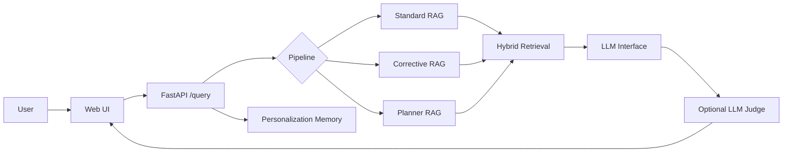

# RAG Framework Documentation

This folder explains the concepts, architecture, and machine learning design behind the RAG Framework application. It is written as a learning guide, so each document explains both the idea and how this codebase implements it.

The application supports three RAG methods:

- Standard RAG
- Corrective RAG
- Planner RAG

It also includes hybrid retrieval, BM25, dense vector search, RRF fusion, reranking, query rewrite quality gates, personalization memory, observability, and an optional LLM-as-judge faithfulness layer.

## Recommended Reading Order

1. [System Design](system-design.md)
2. [ML Design](ml-design.md)
3. [Standard RAG](standard-rag.md)
4. [Corrective RAG](corrective-rag.md)
5. [Planner RAG](planner-rag.md)
6. [Hybrid Retrieval](hybrid-retrieval.md)
7. [BM25 and Vector Search](bm25-and-vector-search.md)
8. [Reciprocal Rank Fusion](reciprocal-rank-fusion.md)
9. [Reranking](reranking.md)
10. [Query Rewriting and Quality Gates](query-rewriting-and-quality-gates.md)
11. [Personalization Memory](personalization-memory.md)
12. [LLM-as-Judge Faithfulness](llm-as-judge-faithfulness.md)
13. [Observability and Tracing](observability-and-tracing.md)
14. [Open Source LLM Interfaces](open-source-llm-interfaces.md)
15. [Deployment and GitHub](deployment-and-github.md)

## System Map

## What Is Not In This Folder

This folder is human-facing documentation. It is not the knowledge base used by the app at runtime. The sample RAG corpus remains in `data/docs/`, and the generated retrieval index remains in `data/index/`.
