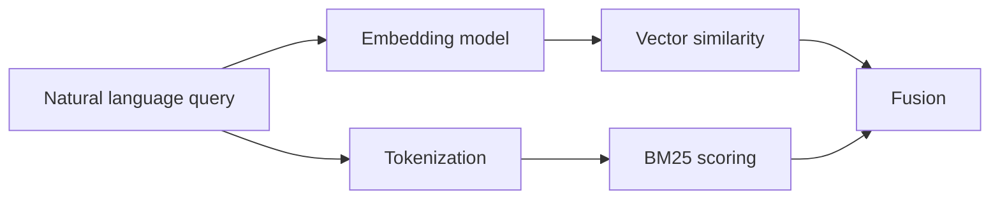

# BM25 and Vector Search

BM25 and vector search are the two retrieval engines used by this application.

## What BM25 Does

BM25 is a sparse keyword search method. It scores chunks based on term overlap, term frequency, inverse document frequency, and document length normalization.

BM25 is useful when the question contains exact tokens such as:

- `GitHub Models`
- `llama.cpp`
- `RERANKER_EVIDENCE_THRESHOLD`
- `rag-framework ingest`

## What Vector Search Does

Vector search embeds text into numeric vectors and compares similarity between the query vector and chunk vectors. It helps when the wording differs but the meaning is similar.

For example, vector search can connect:

```text
How do I build the search files?
```

with:

```text
The ingest command builds the retrieval index.
```

## How They Work Together



## Where It Appears

Source cards show raw scores for `vector` and `bm25`. If a chunk appears in both retrievers, it usually becomes more competitive after RRF fusion.

## Limitations

BM25 can miss semantic matches. Vector search can miss exact identifiers. Together they are stronger, but not perfect.

## Next Improvements

- Add better token normalization for code-like terms.
- Add phrase-aware BM25 boosts.
- Evaluate sparse and dense retrieval separately.

