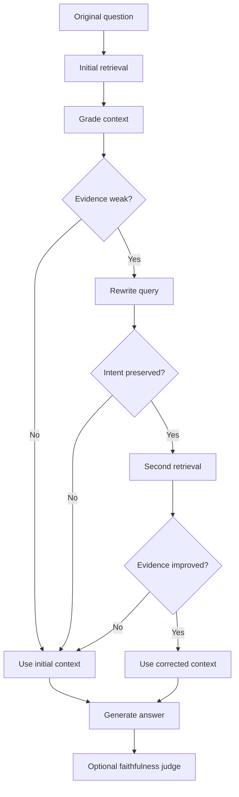

# Corrective RAG

Corrective RAG improves on Standard RAG by checking whether the retrieved context is strong enough. If the evidence is weak, it rewrites the query, retrieves again, and only accepts the rewrite if quality improves.

## Why We Added It

Standard RAG can fail when the first query retrieves weak or incomplete context. Corrective RAG adds guardrails so the system can recover from poor retrieval instead of blindly answering from weak evidence.

## How It Works In This App



The pipeline checks:

- Whether enough chunks survived context grading.
- Whether vector relevance is above `RELEVANCE_THRESHOLD`.
- Whether reranker evidence is above `RERANKER_EVIDENCE_THRESHOLD`.
- Whether rewritten query intent is preserved.
- Whether rewritten retrieval evidence improves by `REWRITE_EVIDENCE_MARGIN`.

## Where It Appears

In the UI, select **Corrective**. The default Corrective question is:

```text
How do I build the search files?
```

The trace shows:

- `Initial Retrieval`
- `Grade Context`
- `Correction Check`
- `Rewrite Query`, if needed
- `Second Retrieval`, if rewrite passes intent checks
- `Rewrite Decision`, if rejected
- `Build Corrected Context`
- `Generate Answer`
- `LLM Judge`, if enabled

## Limitations

Corrective RAG depends on the rewrite quality and the evidence improvement gate. A rewrite can still be too broad, too narrow, or semantically close but operationally unhelpful.

## Next Improvements

- Add multiple rewrite candidates.
- Use a separate query rewrite model.
- Add offline evaluation for rewrite improvement.

