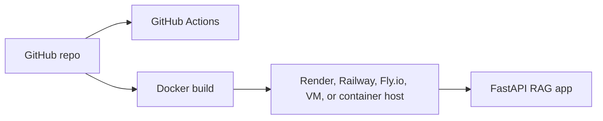

# Deployment and GitHub

This project is stored on GitHub and can be run locally or deployed as a web service.

## GitHub Repository

The project repository contains:

- application source code
- tests
- documentation
- Dockerfile
- GitHub Actions CI workflow
- sample documents

The `.env` file is intentionally excluded from Git because it can contain secrets such as `GITHUB_TOKEN`.

## GitHub Pages Note

GitHub Pages can host static websites, but this RAG application is a FastAPI backend plus UI. GitHub Pages cannot run the API server. A personal website can link to the project repository, but the live app needs a backend host.

## Deployment Shape



## Runtime Requirements

The app needs:

- Python dependencies
- retrieval documents
- generated index files or an ingest step
- LLM provider configuration
- optional judge configuration

## CI

The GitHub Actions workflow runs:

```bash
ruff check .
pytest
```

This catches lint issues and test failures before changes are treated as healthy.

## Next Improvements

- Add a deploy workflow.
- Publish a Docker image to GitHub Container Registry.
- Add production secret management documentation.

