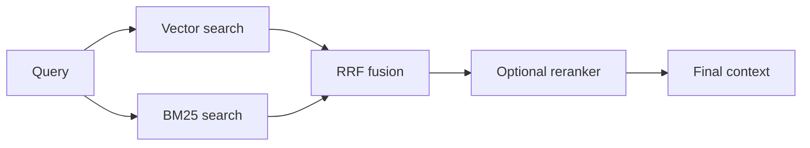

# Hybrid Retrieval

Hybrid retrieval combines dense semantic search with sparse lexical search. In this app, dense vector search helps with meaning, while BM25 helps with exact terms.

## Why We Added It

Dense vector search is good at semantic similarity but can miss exact technical terms. BM25 is good at exact keyword matching but can miss paraphrases. Using both improves robustness.

## How It Works In This App

The retrieval layer:

- embeds the query for vector search
- tokenizes the query for BM25
- retrieves a candidate list from each method
- merges ranks using Reciprocal Rank Fusion
- optionally reranks the fused candidates

## Where It Appears

In the UI, retrieved source cards show:

- final score
- RRF score
- retriever sources, such as `vector + bm25`
- vector, BM25, and reranker ranks when available

## Limitations

Hybrid retrieval improves recall, but it does not guarantee that the top result is sufficient for answering. That is why the app also includes reranking, corrective retrieval, and the judge layer.

## Next Improvements

- Tune BM25 tokenization for technical terms.
- Add query expansion for acronyms.
- Add retrieval metrics such as Recall@K and nDCG.

