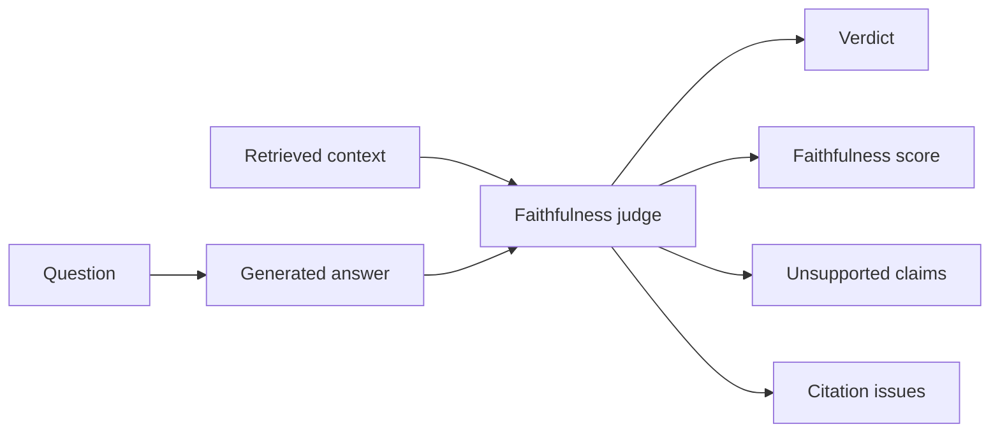

# LLM-as-Judge Faithfulness

The LLM-as-judge layer reviews the generated answer against the retrieved context. It is a trust signal designed to make hallucination risk visible.

## Why We Added It

RAG answers can still hallucinate. Retrieval may be incomplete, the LLM may overgeneralize, or citations may not support the claims. The judge provides a second model pass that asks: "Is this answer grounded in the retrieved evidence?"

## How It Works In This App

The judge returns:

- `verdict`: `grounded`, `partially_grounded`, `unsupported`, or `judge_error`
- `faithfulness_score`: value between `0.0` and `1.0`
- `unsupported_claims`
- `citation_issues`
- `reason`

## Where It Appears

The UI shows:

- a judge badge near the answer title
- judge fields in Run Metadata
- an `LLM Judge` trace step
- a Faithfulness Review panel

## Important Behavior

The parser is tolerant of common LLM variations such as scores written as percentages or `None` written as text. If the judge says `grounded` but also reports issues, the app downgrades the verdict to `partially_grounded`.

## Limitations

LLM judges are not perfect. They can be too strict, too lenient, or inconsistent. They should be combined with retrieval metrics, citation checks, and curated evaluation datasets.

## Next Improvements

- Add a batch evaluation CLI.
- Compare judge models.
- Add CI gates for faithfulness regressions.

