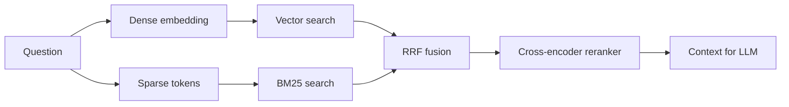
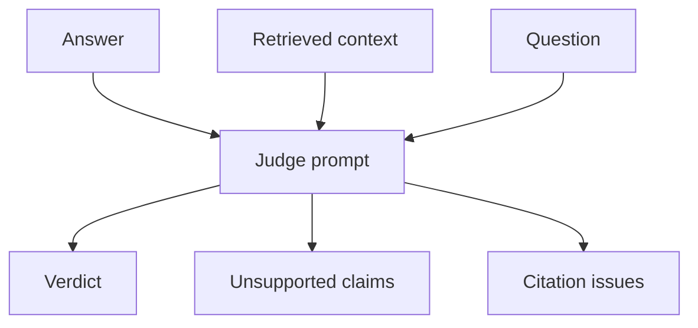
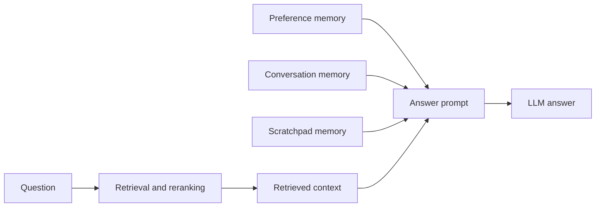

# ML Design

This document explains the machine learning and retrieval design choices in the RAG Framework.

## ML Objective

The goal is to answer user questions from retrieved project documents while reducing hallucination risk. The system does this through retrieval, reranking, corrective query rewriting, planner decomposition, citations, optional personalization, and optional faithfulness judging.

## Retrieval Strategy

The app uses:

- sentence-transformer embeddings for dense retrieval
- BM25 for sparse lexical retrieval
- RRF to merge ranks
- optional cross-encoder reranking

## Chunking

Documents are split into chunks before indexing. Chunking controls the context units that retrieval can return. The app uses configurable chunk size and overlap.

Good chunks should be:

- large enough to preserve meaning
- small enough to avoid noisy context
- traceable back to source files

## Corrective RAG Design

Corrective RAG detects weak evidence and attempts recovery. It uses:

- relevance threshold
- reranker evidence threshold
- query rewrite
- intent preservation gate
- evidence improvement gate

This design avoids accepting rewrites just because they sound better.

## Planner RAG Design

Planner RAG addresses broad questions by decomposing them into sub-questions. Each sub-question gets its own retrieval pass. Evidence is then fused and used for one final answer.

Planner RAG is best for:

- comparisons
- multi-topic questions
- analysis questions

It is not always ideal for simple lookups because it adds cost and latency.

## Faithfulness Judge Design

The optional judge evaluates the final answer against retrieved context. It returns:

- verdict
- faithfulness score
- unsupported claims
- citation issues
- reason

The parser normalizes common LLM output variations and downgrades inconsistent verdicts.

## Personalization Memory Design

Personalization memory is a generation-time control signal. It should adapt answer style, depth, formatting, and continuity, but it should not change what counts as evidence.

The app supports two modes:

- Stateless: use memory included in the current request only.
- Stateful: load and optionally save sanitized memory by `user_id`.

The app separates memory into:

- preferences for tone, depth, and format
- conversation memory for compact summary, current goal, user intent, and topics
- scratchpad memory for facts, decisions, numeric details, links, and open questions

Scratchpad memory is time-dependent and reinforced. Each stored item has timestamps, optional expiry, use count, confidence, importance, and decay rate. The app ranks active scratchpad items before adding them to the generation prompt. Repeated items gain confidence and importance; expired items are removed from prompt context; older items lose rank according to their decay rate.

The important ML boundary is that memory is not part of the retriever corpus. It is not fused with BM25 or vectors, it is not reranked, and it is not cited. This prevents personalization notes from becoming unsupported facts.

## Evaluation Strategy

The next evaluation layer should use a curated dataset with:

- question
- expected sources
- required answer facts
- forbidden hallucinated facts
- answerable or unanswerable label
- personalization preference label when style adaptation is being tested

Recommended metrics:

- Recall@K
- MRR
- nDCG
- answer faithfulness
- citation accuracy
- no-answer accuracy
- personalization adherence without factual drift

## Known Tradeoffs

- Reranking improves precision but adds latency.
- Corrective RAG improves recovery but adds LLM calls.
- Planner RAG improves multi-part retrieval but can over-decompose.
- LLM judges improve visibility but are not perfect ground truth.
- Personalization improves usability but can create answer-shaping risk if treated as evidence.

## Next Improvements

- Add `evals/` with JSONL datasets.
- Add batch evaluation CLI.
- Add dashboards for retrieval and faithfulness metrics.
- Track metric regressions in CI.
