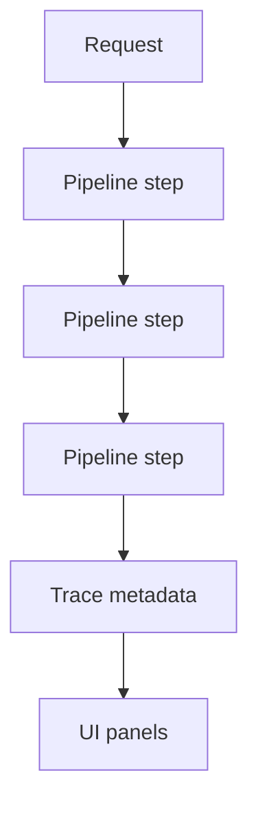

# Observability and Tracing

Observability helps users understand what the RAG system did before producing an answer.

## Why We Added It

RAG systems can fail in several places: retrieval, reranking, rewriting, answer generation, and judging. A plain answer hides those details. The trace makes the pipeline inspectable.

## What The App Tracks

The API response includes:

- pipeline name
- trace ID
- total duration
- provider and model
- source count
- best and mean scores
- correction status
- reranker status
- judge status, verdict, and faithfulness score
- step-by-step pipeline events

## How It Works

Each pipeline builds `PipelineStep` records as it runs. The API adds `TraceMetadata` before returning the response.

## Where It Appears

The UI includes:

- Run Metadata panel
- Execution Timeline
- source cards
- Faithfulness Review panel

## Limitations

Trace data explains what happened, but it does not automatically determine quality. That is why the app also needs evaluation datasets and judge scoring.

## Next Improvements

- Persist traces.
- Add downloadable trace JSON.
- Add aggregate metrics over many runs.

