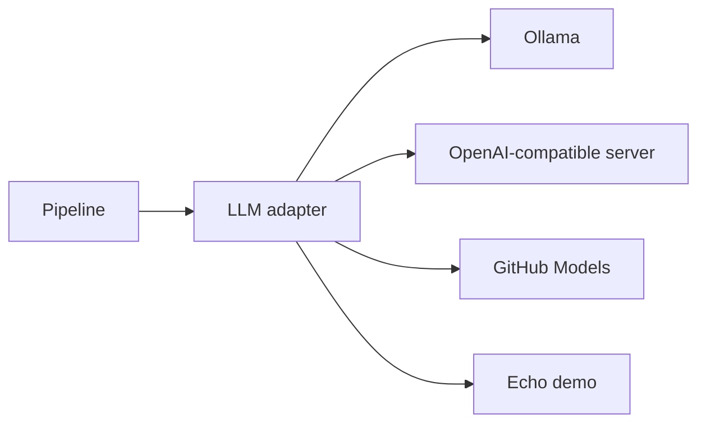

# Open Source LLM Interfaces

The application is designed to work with open-source-friendly LLM interfaces instead of being tied to one vendor.

## Supported Interfaces

The app supports:

- `ollama`
- `openai-compatible`
- `github-models`
- `echo`, for deterministic local demos and tests

OpenAI-compatible servers include tools such as vLLM, llama.cpp server, LM Studio, and similar local model gateways.

## Why We Added This

RAG infrastructure should be portable. The retrieval logic, UI, judge layer, and pipeline traces should not depend on a single model provider.

## How It Works In This App

The `create_llm` factory chooses an adapter based on `LLM_PROVIDER`. The judge can use the same provider or a separate judge provider.

## Where It Appears

The Run Metadata panel shows the provider and model used for answer generation. When the judge is enabled, it also shows the judge model.

## Limitations

Different providers may format outputs differently. This matters most for structured outputs such as judge JSON. The app includes parsing safeguards, but model behavior should still be tested.

## Next Improvements

- Add provider-specific health checks.
- Add model capability documentation.
- Add structured-output enforcement where supported.

