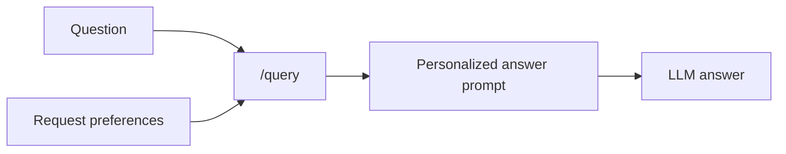
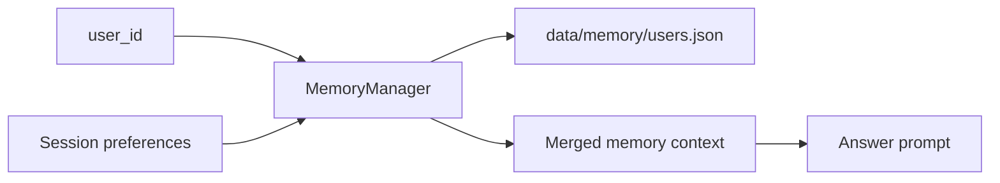

# Personalization Memory

Personalization memory adapts how the assistant explains retrieved information for a user. In this app, memory is intentionally separated from retrieval evidence: it can shape tone, depth, examples, and formatting, but it is not cited as a source and is not treated as factual corpus context.

## Why We Added It

RAG answers are easier to use when they match the reader. A beginner may want simple explanations, while an engineer may want implementation details and tradeoffs. Personalization gives the app a way to remember or accept these preferences without changing the underlying retrieved facts.

## Stateless Memory

Stateless memory uses only the preferences sent with the current request.

Use stateless memory when:

- the app should not persist user data
- the caller already knows the user preferences
- the request is one-off or anonymous

## Stateful Memory

Stateful memory stores sanitized preferences by `user_id` in a local JSON store.

Stateful memory is useful when:

- the same user returns across sessions
- the app should remember preferred answer style
- UI defaults should become durable after the user chooses them

## How It Works In This Application

The `/query` request can include:

- `memory_mode`: `stateless` or `stateful`
- `user_id`: required for stateful memory
- `session_preferences`: request-level preferences such as depth or format
- `remember_preferences`: whether to persist request preferences

The `MemoryManager` sanitizes preference keys and values. In stateful mode, it loads existing preferences for the `user_id`, merges them with current request preferences, and optionally saves the merged result.

The final answer prompt receives a personalization block with strict boundaries:

- use preferences only for tone, depth, formatting, and examples
- do not treat memory as retrieved factual evidence
- do not cite memory as a source

Retrieval, RRF, reranking, corrective rewrite gates, and planner decomposition continue to use the original question and retrieved corpus.

## Where It Appears In The UI Or Trace

The UI includes a Memory panel with:

- stateless/stateful mode selection
- user ID
- preference inputs
- remember toggle

Run metadata shows:

- memory mode
- memory user
- whether memory was loaded
- whether memory was saved
- active personalization preferences

The pipeline trace also shows personalization details in the context-building step.

## Limitations

- The first implementation stores only simple preferences, not long conversation history.
- The local JSON store is suitable for demos and local development, not multi-user production.
- Memory does not yet have consent workflows, deletion APIs, TTLs, or audit history.
- Personalization is not used to improve retrieval ranking.

## Next Improvements

- Add memory management endpoints for view, update, delete, and export.
- Add per-field consent and expiration.
- Move production memory to a database with encryption at rest.
- Add preference extraction from conversation turns with human confirmation.
- Add tests that evaluate whether personalization changes style without changing factual grounding.
