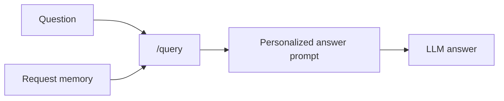
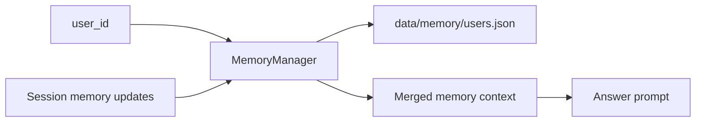

# Personalization Memory

Personalization memory adapts how the assistant explains retrieved information and preserves useful working context between sessions. In this app, memory is intentionally separated from retrieval evidence: it can shape tone, depth, examples, formatting, conversation continuity, and working notes, but it is not cited as a source and is not treated as factual corpus context.

## Why We Added It

RAG answers are easier to use when they match the reader and remember important working context. A beginner may want simple explanations, while an engineer may want implementation details and tradeoffs. A project owner may also want durable facts, decisions, thresholds, repo links, and open questions preserved outside the model's short-term context window.

## Memory Buckets

The app keeps three separate memory buckets per user:

- Preference memory: style preferences such as `depth` and `format`.
- Conversation memory: compact summary, current goal, overall intent, and recent topics.
- Scratchpad memory: durable facts, decisions, and open questions that should not get lost across context compaction or app restarts.

The app does not store full raw questions by default.

## Time-Dependent And Reinforced Memory

Stateful scratchpad memory is stored as structured memory items. Users can still submit plain strings, but the backend promotes them into records with lifecycle and ranking metadata.

```json
{
  "text": "Repo is Piyushmittal2192/rag_frameworks",
  "type": "fact",
  "created_at": "2026-06-13T10:00:00+00:00",
  "updated_at": "2026-06-13T10:30:00+00:00",
  "last_used_at": "2026-06-13T11:00:00+00:00",
  "use_count": 3,
  "confidence": 0.85,
  "importance": 0.71,
  "decay_rate": 0.01,
  "expires_at": null
}
```

The memory scorer ranks active scratchpad items with this idea:

```text
memory_score =
  importance
  + confidence
  + reinforcement_boost
  - time_decay
```

Where:

- `reinforcement_boost` increases with `use_count`, up to a small cap.
- `time_decay` grows as the item gets older.
- `expires_at` removes temporary memory once it is no longer valid.

Different memory types use different defaults:

- `fact`: medium importance, light decay.
- `decision`: high importance, very slow decay.
- `open_question`: high importance, faster decay because open questions should eventually be resolved or refreshed.

When an item is repeated in a new request, the app treats that as reinforcement. It increments `use_count`, updates `last_used_at`, and slightly raises confidence and importance. This means stable repeated facts become more likely to stay in the prompt, while stale or expired temporary facts fall away.

## Stateless Memory

Stateless memory uses only the memory sent with the current request.



Use stateless memory when:

- the app should not persist user data
- the caller already knows the relevant preferences or working context
- the request is one-off or anonymous

## Stateful Memory

Stateful memory stores sanitized memory by `user_id` in a local JSON store.



Stateful memory is useful when:

- the same user returns across sessions
- the app should remember preferred answer style
- project decisions, numeric thresholds, and open questions need a durable scratchpad
- UI defaults should become durable after the user chooses them

## How It Works In This Application

The `/query` request can include:

- `memory_mode`: `stateless` or `stateful`
- `user_id`: required for stateful memory
- `session_preferences`: request-level preferences such as depth or format
- `remember_preferences`: whether to persist request preferences
- `conversation_memory`: summary, current goal, intent, and recent topics
- `remember_conversation_memory`: whether to persist conversation memory updates
- `scratchpad_memory`: facts, decisions, and open questions
- `remember_scratchpad_memory`: whether to persist scratchpad updates

Example stateful memory shape:

```json
{
  "local-demo": {
    "preferences": {
      "depth": "concise technical explanation",
      "format": "numbered steps with citations"
    },
    "conversation": {
      "conversation_summary": "Built RAG app and added memory design.",
      "current_goal": "Add per-user scratchpad memory.",
      "user_intent": "Build an educational deployable RAG framework.",
      "recent_topics": ["RAG", "memory", "faithfulness"]
    },
    "scratchpad": {
      "scratchpad_facts": [
        {
          "text": "Repo is Piyushmittal2192/rag_frameworks",
          "type": "fact",
          "created_at": "2026-06-13T10:00:00+00:00",
          "updated_at": "2026-06-13T10:00:00+00:00",
          "last_used_at": null,
          "use_count": 0,
          "confidence": 0.75,
          "importance": 0.65,
          "decay_rate": 0.01,
          "expires_at": null
        }
      ],
      "scratchpad_decisions": [
        {
          "text": "Memory is not cited as retrieval evidence",
          "type": "decision",
          "created_at": "2026-06-13T10:00:00+00:00",
          "updated_at": "2026-06-13T10:00:00+00:00",
          "last_used_at": null,
          "use_count": 0,
          "confidence": 0.75,
          "importance": 0.9,
          "decay_rate": 0.001,
          "expires_at": null
        }
      ],
      "scratchpad_open_questions": [
        {
          "text": "Should memory influence retrieval expansion?",
          "type": "open_question",
          "created_at": "2026-06-13T10:00:00+00:00",
          "updated_at": "2026-06-13T10:00:00+00:00",
          "last_used_at": null,
          "use_count": 0,
          "confidence": 0.75,
          "importance": 0.75,
          "decay_rate": 0.02,
          "expires_at": null
        }
      ]
    },
    "updated_at": "..."
  }
}
```

The `MemoryManager` sanitizes preference keys, text fields, and list items. In stateful mode, it loads existing memory for the `user_id`, merges it with current request memory, optionally saves each bucket independently, filters expired scratchpad items, ranks scratchpad items, and reinforces items that are reused.

The final answer prompt receives a personalization block with strict boundaries:

- use preferences to adapt tone, depth, formatting, and examples
- use conversation and scratchpad memory for continuity and reminders
- do not treat memory as retrieved factual evidence
- do not cite memory as a source

Retrieval, RRF, reranking, corrective rewrite gates, and planner decomposition continue to use the original question and retrieved corpus.

## Where It Appears In The UI Or Trace

The UI includes a Memory panel with:

- stateless/stateful mode selection
- user ID
- preference inputs
- conversation summary, current goal, intent, and topics
- scratchpad facts, decisions, and open questions
- separate remember toggles for style, conversation, and scratchpad memory

Run metadata shows:

- memory mode
- memory user
- whether preference memory was loaded or saved
- whether conversation memory was loaded or saved
- whether scratchpad memory was loaded or saved
- active personalization preferences
- recent topics
- scratchpad facts, decisions, and open questions

The pipeline trace also shows memory details in the context-building step.

## Limitations

- The first implementation stores compact summaries and explicit scratchpad items, not long conversation history.
- The local JSON store is suitable for demos and local development, not multi-user production.
- Memory does not yet have consent workflows, deletion APIs, TTLs, or audit history.
- Personalization is not used to improve retrieval ranking.
- Intent/topic memory is user-provided; it is not automatically inferred from every turn yet.
- Time-dependent scoring currently applies to scratchpad memory, not style preferences or conversation summaries.

## Next Improvements

- Add memory management endpoints for view, update, delete, and export.
- Add per-field consent and expiration.
- Move production memory to a database with encryption at rest.
- Add optional LLM-assisted conversation summarization and intent extraction.
- Add preference extraction from conversation turns with human confirmation.
- Add UI controls for per-item expiry, confidence, and importance.
- Add explicit "resolved" state for open questions.
- Add tests that evaluate whether personalization changes style without changing factual grounding.
