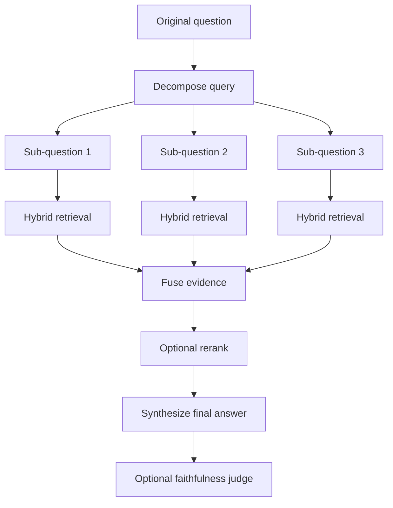

# Planner RAG

Planner RAG decomposes broad or multi-part questions into focused sub-questions. It retrieves evidence for each sub-question, fuses the evidence, and asks the LLM to produce one final answer.

## Why We Added It

Some questions are too broad for one retrieval query. For example:

```text
Compare Standard RAG, Corrective RAG, and Planner RAG.
```

A single search may retrieve only one part of the answer. Planner RAG creates focused retrieval tasks so each part has a better chance of getting relevant evidence.

## How It Works In This App



The decomposition step is bounded to keep latency and cost under control. In the current app, Planner RAG uses at most four sub-questions.

## Where It Appears

In the UI, select **Planner**. The default Planner question is:

```text
Compare Standard RAG, Corrective RAG, and Planner RAG.
```

The trace shows:

- `Decompose Query`
- `Retrieve Sub-query 1`
- `Retrieve Sub-query 2`
- more sub-query retrieval steps if needed
- `Fuse Sub-query Evidence`
- `Build Planned Context`
- `Generate Answer`
- `LLM Judge`, if enabled

## Limitations

Planner RAG adds LLM cost and latency because it first asks for a plan, then performs retrieval per sub-question. It is best for broad questions, comparisons, and analysis questions.

## Next Improvements

- Add plan quality evaluation.
- Remove duplicate sub-questions before retrieval.
- Cache sub-query retrieval results.

