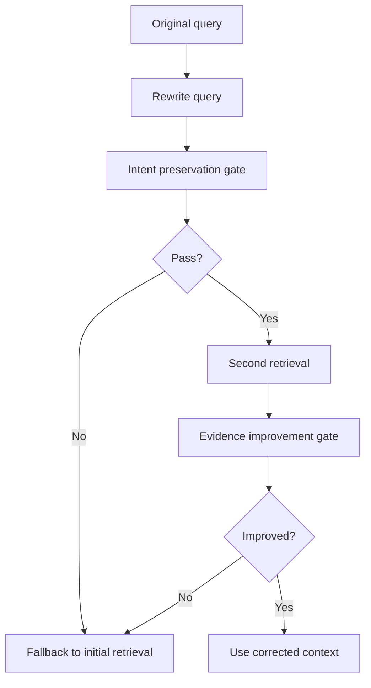

# Query Rewriting and Quality Gates

Query rewriting is used by Corrective RAG when the first retrieval pass looks weak. The rewrite is not accepted automatically. It must pass quality gates.

## Why We Added It

Poor retrieval can happen because the user question is phrased differently from the documents. A rewrite can make the search query more retrieval-friendly, but a bad rewrite can drift away from the original intent.

## How It Works In This App

The intent gate checks:

- embedding similarity between original and rewritten query
- important term preservation
- polarity preservation, such as not changing "not supported" into "supported"

The evidence gate checks whether the rewritten query improves retrieved evidence enough.

## Where It Appears

The Corrective RAG trace shows:

- `Rewrite Query`
- `Second Retrieval`
- `Rewrite Decision`

The UI displays intent similarity, term preservation, polarity change, and evidence improvement details.

## Limitations

Rewrite checks reduce risk but do not prove correctness. They are guardrails, not guarantees.

## Next Improvements

- Generate multiple candidate rewrites.
- Use an LLM judge to score rewrite quality.
- Add regression tests for tricky negation and unsupported-feature questions.

