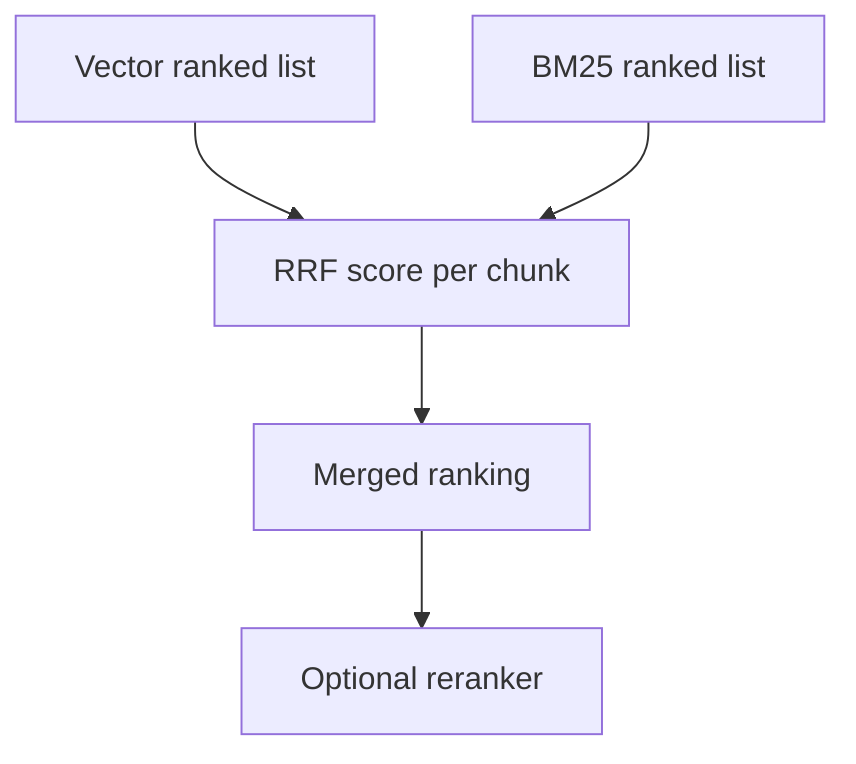

# Reciprocal Rank Fusion

Reciprocal Rank Fusion, or RRF, combines multiple ranked lists without trying to compare incompatible raw scores.

## Why We Added It

Vector scores and BM25 scores are not on the same scale. A vector score of `0.55` and a BM25 score of `4.2` do not mean the same thing. RRF avoids that problem by using rank positions instead of raw score magnitudes.

## How It Works

For each retriever result list, each chunk receives:

```text
1 / (k + rank)
```

This app uses the common default:

```text
k = 60
```

If a chunk appears in both vector and BM25 results, it receives contributions from both lists.

## Diagram



## Where It Appears

The UI source cards include an `RRF` value. This value is usually small because the formula intentionally uses small reciprocal scores.

## Limitations

RRF improves rank fusion, but it does not understand the content. It is still possible for a fused result to be irrelevant. The reranker and judge layer help reduce that risk.

## Next Improvements

- Tune the RRF `k` parameter.
- Compare RRF against weighted score normalization.
- Evaluate impact on Recall@K and MRR.

