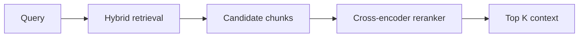

# Reranking

Reranking reorders retrieved candidate chunks using a model that directly compares the query and chunk text.

## Why We Added It

Vector search and BM25 retrieve candidates quickly, but they are not always precise. A cross-encoder reranker can look at the full query and candidate chunk together, then produce a stronger relevance score.

## How It Works In This App



When enabled, the app uses:

```text
cross-encoder/ms-marco-MiniLM-L-6-v2
```

The reranker writes:

- `raw_scores.reranker`
- `ranks.reranker`
- final `score`

## Where It Appears

The source cards show reranker scores and ranks. The trace also shows whether reranking was enabled.

## Limitations

Rerankers add latency and can produce negative scores. Negative scores are not automatically errors; they are model-specific relevance logits.

## Next Improvements

- Calibrate reranker scores for clearer UI thresholds.
- Compare multiple reranker models.
- Add reranker latency and score distribution charts.

