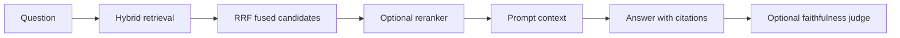

# Standard RAG

Standard RAG is the baseline retrieval augmented generation pattern. It retrieves relevant context, sends that context to an LLM, and asks the LLM to answer using only the retrieved evidence.

## Why We Added It

Standard RAG gives the application a simple, understandable baseline. It is fast, predictable, and useful when the user asks a focused question that can be answered from a small set of retrieved chunks.

## How It Works In This App



The standard pipeline:

1. Embeds the user question.
2. Searches dense vectors and BM25 lexical index.
3. Merges results with RRF.
4. Optionally reranks candidates with a cross-encoder.
5. Builds the answer prompt from top chunks.
6. Calls the configured LLM.
7. Optionally sends the answer to the LLM-as-judge.

## Where It Appears

In the UI, select **Standard** in the pipeline control. The default Standard question is:

```text
What open source LLM interfaces are supported?
```

In the trace, Standard RAG shows:

- `Retrieve`
- `Build Context`
- `Generate Answer`
- `LLM Judge`, if enabled

## Limitations

Standard RAG trusts the first retrieval result set. If retrieval misses the right context, the answer can be incomplete or unsupported. That is why this app also includes Corrective RAG and Planner RAG.

## Next Improvements

- Add retrieval evaluation datasets.
- Show retrieval confidence calibration.
- Add automatic no-answer thresholds.

