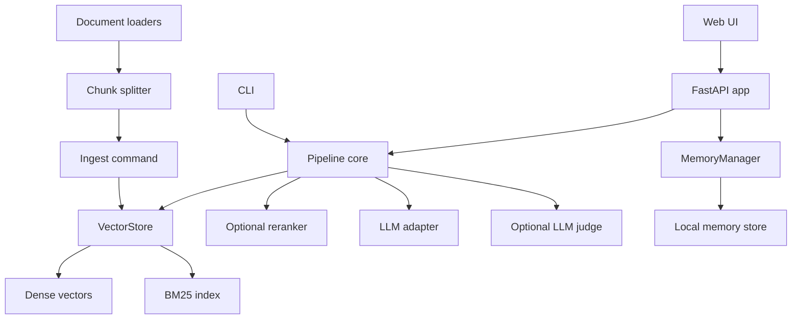
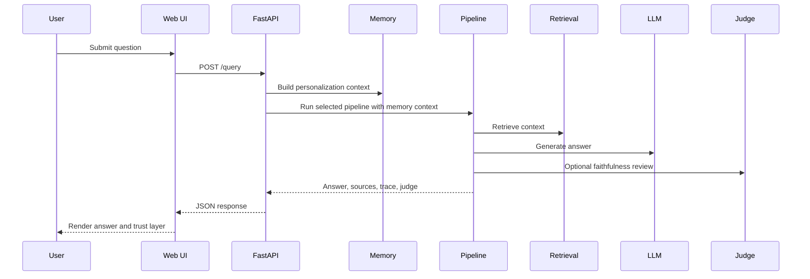

# System Design

This document explains how the RAG Framework application is structured as a system.

## High-Level Architecture



## Main Components

- Web UI: sends `/query` requests and renders answer, sources, trace, diagrams, and faithfulness review.
- FastAPI app: initializes settings, embedder, vector store, LLM, reranker, judge, and pipelines.
- CLI: supports ingestion and command-line question answering.
- Pipeline core: implements Standard, Corrective, and Planner RAG.
- VectorStore: persists chunks, dense vectors, and BM25 state.
- MemoryManager: builds stateless or stateful personalization context for answer generation.
- LLM adapters: support Ollama, OpenAI-compatible servers, GitHub Models, and Echo demo mode.
- Judge: optionally evaluates answer faithfulness against retrieved context.

## Request Flow



## Public Interfaces

The main API endpoint is:

```text
POST /query
```

Request fields:

- `question`
- `pipeline`: `standard`, `corrective`, or `planner`
- `top_k`
- `memory_mode`: `stateless` or `stateful`
- `user_id`: required for stateful memory
- `session_preferences`: per-request personalization preferences
- `remember_preferences`: persist current preferences when stateful

Response includes:

- answer text
- sources
- pipeline steps
- trace metadata
- optional judge result
- personalization metadata

## Configuration

Important environment settings include:

- document and index paths
- memory store path
- embedding model
- LLM provider and model
- reranker enablement and model
- corrective RAG thresholds
- judge enablement and model

Secrets should stay in `.env` or the deployment platform secret store, not in Git.

## Deployment Model

The app is a FastAPI service. It can run locally with Uvicorn or inside Docker. GitHub Pages can link to the project but cannot host the backend API.

## Failure Modes

- Missing index: run ingestion before querying.
- Weak retrieval: use Corrective RAG or Planner RAG.
- LLM provider unavailable: check provider URL, token, and model name.
- Judge parse issues: parser falls back to `judge_error`.
- Missing stateful user ID: API returns a validation error instead of writing anonymous memory.
- High latency: disable reranker or judge, reduce `top_k`, or use a faster model.

## Extension Points

- Add new retrievers behind `VectorStore.search`.
- Add more LLM adapters behind `create_llm`.
- Add more pipeline classes following the `answer(question)` pattern.
- Replace the local JSON memory store with a production database.
- Add persistent trace storage.
